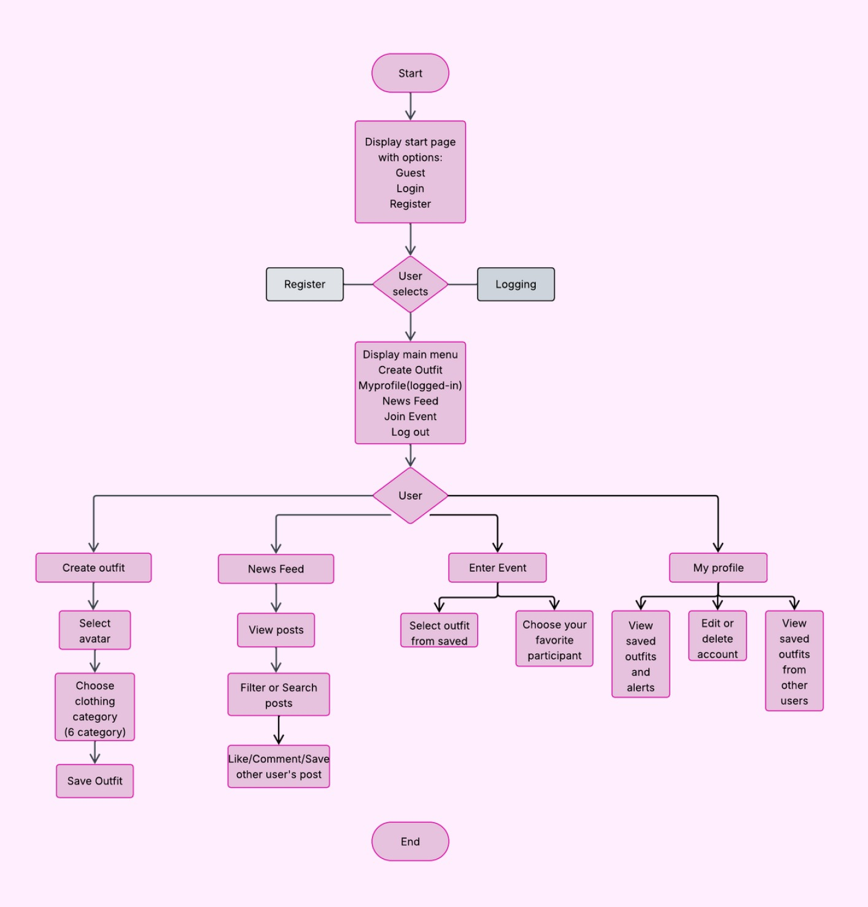

# Dress-Up Web Application

A "Dress to Impress" inspired social media platform and fashion game. This web application allows users to design virtual outfits, share their creations on a public feed, and compete in fashion contests.

## 🎬 Live Demo

You can watch a full video demonstration of the application's features, hosted directly on this repository's GitHub Pages site:

**[➡️ Click here to watch the demo](https://Denisa2004.github.io/Dress-Up-Web-Application/)**

---

## 📖 Project Context: Software Development Methods

This project was developed by a team of 5 students for the "Software Development Methods" course. The primary goal was not just to deliver a functional product, but to simulate a professional industry environment by emphasizing a structured development process.

* **Methodology:** We adopted the **Agile (Scrum)** framework.
* **Project Management:** We used **Jira** to manage our entire development lifecycle.
* **Requirements:** The project was built from the ground up based on **User Stories**, defining features from the perspective of our key roles (Guest, User, Admin).
* **Planning:** Development was organized into **Sprints**, each with clear goals and deliverables, allowing our team to iterate and adapt effectively.

---

## ✨ Key Features

The platform is built around three main roles, each with specific functionalities derived from our user stories.

### 👤 For Guests (Unauthenticated)
* **Explore:** View popular and recent outfits to stay on-trend.
* **Search:** Find outfits by theme.
* **Test Drive:** Create a temporary avatar to test the basic outfit creation features.
* **Account:** Register for a new account or log in.

### 🎀 For Users (Authenticated)
* **Outfit Creator:** Design outfits by selecting an avatar and choosing from 6 categories of clothing items. Features an integrated AI chatbot assistant 🤖 to provide styling advice and creative feedback.
* **Social Feed:** Publish creations to a main "News Feed" where other users can **Like**, **Comment**, and **Save** them.
* **Contests (Events):** Enter themed contests with saved outfits to compete against other users.
* **Personal Profile:** Manage account details and view a personal gallery of created and saved outfits for inspiration.

### 👑 For Administrators
* **Contest Management:** Start and stop contests to encourage user interaction.
* **Moderation:** Delete any content (posts, comments) that violates platform rules and issue warnings and send alerts to users.
* **User Management:** Grant administrator roles to other users.

---

## 🗺️ Application User Flow

Our core navigation logic is designed to be intuitive, guiding the user from start-up, through login/register, and into the main features like the News Feed, Outfit Creator, Events, and Profile.

---

## 💻 Tech Stack

* **Backend:** **C#**
* **Framework:** **ASP.NET MVC (Model-View-Controller)**
* **Frontend:** **Razor Pages (`.cshtml`)**, HTML5, CSS3, JavaScript
* **Database:** **SQL**
* **Project Management:** **Jira** (Agile Sprints)
* **Hosting (Demo Page):** **GitHub Pages**

---
